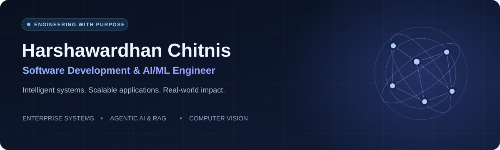
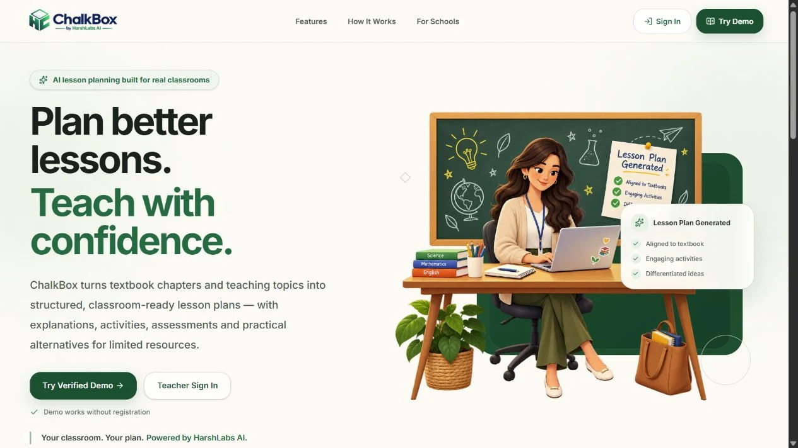
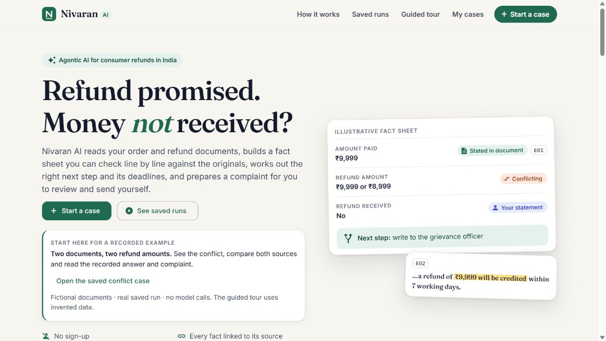
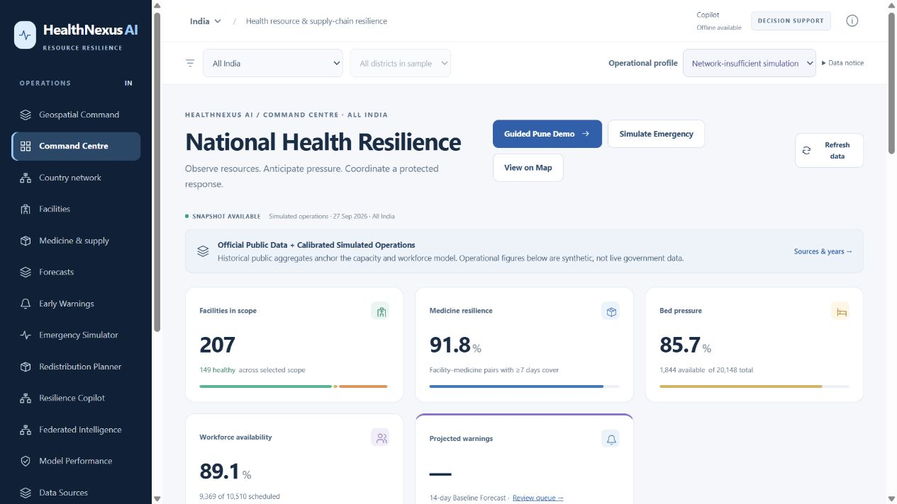
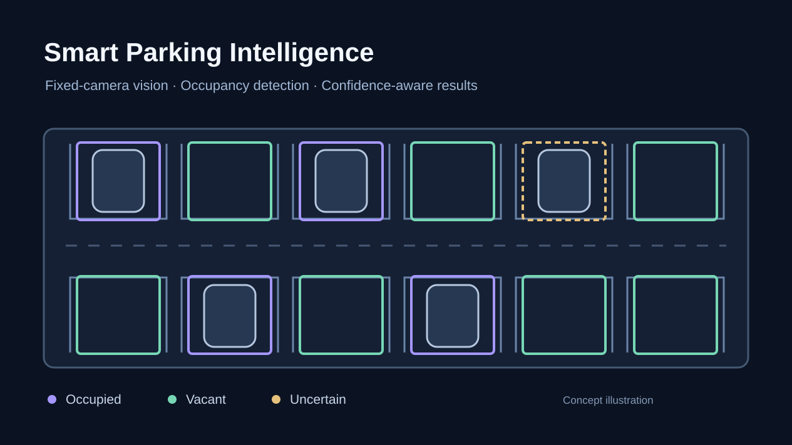

I build **intelligent systems and scalable enterprise applications** that solve real-world problems. My work spans core banking at **Tata Consultancy Services**, agentic AI and RAG, full-stack development, and computer vision.

Based in **Pune, India** · Open to opportunities in **software development and AI/ML engineering**.

**[Explore my portfolio](https://harshawardhanchitnis.github.io/)** · **[View résumé](https://drive.google.com/file/d/1RSHu7IOVLDo88-C0k5VQjpUpUMFefZE0/view?usp=sharing)** · **[LinkedIn](https://www.linkedin.com/in/harshawardhanchitnis/)** · **[Email](mailto:hchitnis20042002@gmail.com)**

## Featured projects

<table>
<tr>
<td width="50%" valign="top">

<h3>ChalkBox</h3>

An AI classroom assistant that turns textbook content into lesson plans with page-level sources, a separate audit step, and Hindi support.

<strong>React · TypeScript · Supabase · pgvector · RAG</strong>

Omnikon 2026 finalist — <strong>9th of 126 teams</strong>.

<a href="https://chalkbox-harshlabs.pages.dev">Live demo</a> · <a href="https://github.com/harshawardhanchitnis/ChalkBox-AI-Lesson-Planning-for-Real-Classrooms">Code</a> · <a href="https://harshawardhanchitnis.github.io/projects/chalkbox">Case study</a>

</td>
<td width="50%" valign="top">

<h3>Nivaran AI</h3>

An agentic refund-resolution prototype that organizes evidence, flags conflicting facts, and prepares a complaint after the user approves a plan.

<strong>Angular · Node.js · Supabase · AI SDK · Zod</strong>

Built for <strong>WCC Launchpad 30</strong>. Users review and send drafts themselves.

<a href="https://nivaran-ai-green.vercel.app">Live demo</a> · <a href="https://github.com/harshawardhanchitnis/Nivaran-AI">Code</a> · <a href="https://harshawardhanchitnis.github.io/projects/nivaran-ai">Case study</a>

</td>
</tr>
<tr>
<td width="50%" valign="top">

<h3>HealthNexus AI</h3>

A healthcare resource-planning prototype combining forecasts, advisory redistribution plans, map-based operations, and an evidence-aware AI copilot.

<strong>Angular · FastAPI · OR-Tools · MapLibre · PyTorch</strong>

Demonstrates planning with <strong>simulated data and fictional facilities</strong>.

<a href="https://healthnexus-ai.web.app">Live demo</a> · <a href="https://github.com/harshawardhanchitnis/HealthNexus-AI">Code</a> · <a href="https://harshawardhanchitnis.github.io/projects/healthnexus-ai">Case study</a>

</td>
<td width="50%" valign="top">

<h3>Smart Parking Intelligence</h3>

A fixed-camera parking analysis system that detects slot geometry and classifies occupancy, preserving uncertain results when confidence is low.

<strong>Next.js · FastAPI · OpenCV · YOLO · ONNX Runtime</strong>

Computer vision with <strong>confidence-aware decisions</strong>.

<a href="https://github.com/harshawardhanchitnis/Artificial-Intelligence-Based-Smart-Parking-System-">Code</a> · <a href="https://harshawardhanchitnis.github.io/projects/smart-parking">Case study</a>

</td>
</tr>
</table>

### More of my work

| Project | What I built | Explore |
| :--- | :--- | :--- |
| **Privacy-Aware Face Analytics** | Multi-face detection and tracking, anonymization, persistent analytics, and model lifecycle workflows. | [Case study](https://harshawardhanchitnis.github.io/projects/privacy-aware-face-analytics) |
| **PowerBill** | Spring Boot and Angular electricity billing with customer/admin workflows, payments, complaints, and service discovery. | [Code](https://github.com/harshawardhanchitnis/Project-FullStack-SpringBoot-Angular-Electricity-Bill-Management-System-PowerBill) · [Case study](https://harshawardhanchitnis.github.io/projects/electricity-bill-management-system) |
| **Document RAG Chatbot** | PDF retrieval with FAISS and Sentence Transformers; answer evaluation using ROUGE-1 and cosine similarity. | [Code](https://github.com/harshawardhanchitnis/Project-Artificial-Intelligence-RAG-Chatbot-With-Accuracy-Evaluation) · [Case study](https://harshawardhanchitnis.github.io/projects/rag-chatbot-for-pdf-documents) |
| **Insurance Cost Prediction** | Regression models, exploratory analysis, and an interactive prediction workflow. | [Code](https://github.com/harshawardhanchitnis/Project-Machine-Learning-Medical-Insurance-Cost-Prediction) · [Case study](https://harshawardhanchitnis.github.io/projects/medical-insurance-cost-prediction) |
| **LSTM Text Generation** | Sequence modeling and temperature-based text generation with stacked LSTM networks. | [Code](https://github.com/harshawardhanchitnis/Project-Machine-Learning-LSTM-Based-Next-Word-Generation-Deep-Learning-Model-For-Text-Generation) |

## Experience

**Tata Consultancy Services · Assistant System Engineer Trainee** 
April 2025 – April 2026 · State Bank of India (GITC)

- Supported core banking workflows, real-time APIs, and scheduled batch operations.
- Worked with Oracle SQL/PLSQL, shell-based monitoring and log analysis, and Oracle WebLogic deployments.
- Collaborated on production troubleshooting and completed the Java full-stack Initial Learning Program covering Spring Boot, Angular, SQL, and REST APIs.

## Tools I work with

| Area | Technologies |
| :--- | :--- |
| **Languages** | Java · Python · SQL · TypeScript · JavaScript · Shell |
| **Application engineering** | Spring Boot · Angular · React · Next.js · FastAPI · REST APIs |
| **AI & computer vision** | PyTorch · TensorFlow · scikit-learn · OpenCV · YOLO · ONNX Runtime · MLflow |
| **Retrieval & agents** | RAG · FAISS · Sentence Transformers · pgvector · LangChain · LangGraph |
| **Data & delivery** | Oracle · PostgreSQL · MySQL · Supabase · Docker · Git · Linux |

## Research & recognition

- **IEEE ICCUBEA 2024 publication:** [Integrated Vehicle Accidental Alert – IoT Based Intelligent System](https://ieeexplore.ieee.org/document/10774762).
- **TCS AI Hackathon 2025:** Ideapreneur Phase Winner.
- **Omnikon National AI/ML Hackathon 2026:** Top 10 finalist, **rank 9/126**, with Team HarshLabs and ChalkBox.
- **TCS:** Learning Achievement Award and Star Team Award.
- **Leadership:** Machine Learning Head, Google Developer Student Club, NBNSSOE.
- **Certifications:** Microsoft Azure AI Fundamentals (AI-900), **889/1000**; PrepInsta Java Coding Certificate.

<strong>Education & ongoing learning</strong>

| Institution | Program | Period |
| :--- | :--- | :--- |
| **D.Y. Patil Vidyapeeth** | MBA in Artificial Intelligence and Machine Learning | Jul 2026 – Jul 2028 · Ongoing |
| **IIT Bombay** | E-Postgraduate Diploma in Computer Science and Artificial Intelligence | Jan 2026 – Jan 2027 · Ongoing |
| **COEP Technological University** | Postgraduate Diploma in Data Science and Artificial Intelligence | Sep 2025 – Dec 2026 · Ongoing |
| **NBN Sinhgad School of Engineering, SPPU** | B.E. in Information Technology · **GPA 9.08/10** | Jun 2020 – Jun 2024 · Completed |

---

**Have a project or opportunity in mind?** [Get in touch](mailto:hchitnis20042002@gmail.com) or [explore the full portfolio](https://harshawardhanchitnis.github.io/).
